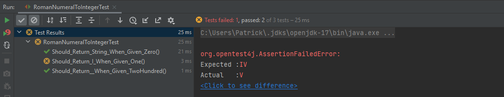
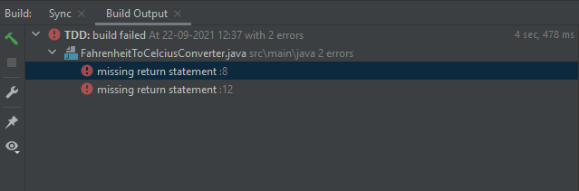
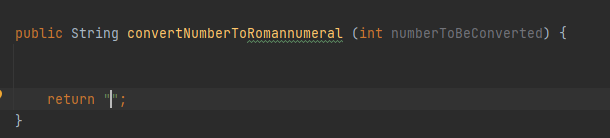

Assignement 1

1 REFLECTIONS
______________
1.1 SHOOTING
For at analysere dette spørgsmål kan man inddele problemmet i følgende variabler:

Kvinden
- Kvindens Alder
- Træning/Skill lvl
- Biologisk helbred - Altså om hun har syns problemmer, problemer med ørestenen osv.

Våbenet
- Hvilket model
- Kendte defects
- Skud størrelse og kaliber

Manden
- Hvilket beklædning har han på
- Helbred osv

Selvet processen
- Hvilken afstand skudet blev affyret fra
- Hvor skudet er ramt og hvilke organner dette påvirker
- Om skudet ramte... da der står "fired a shot at a man with her gun" hvilket ikke fastslår at han rammes.
- Hvad der sker efter processen

1.2 ALIEN

Alt afhænigig af hvor detaljeret der er behov for kunne man gå ned i individuelle finger/arm muskler. Dog er min fortolkelse af denne opgave ikke at dette er nødvendigt.

1. Placer 1 valgfri hånd over tandbørste
2. Spænd håndmuskler rundt om tandbørste
3. Løft tandbørsten fra startsted.
4. Om nødvendigt. Roter tandbørste så hår pejer op og plastik bagkanten pejer ned.
5. Med arm der ikke er anvendt. Følg trin 1 2 og 3 hvor punkt 3 tager tandpasta istedet for tandbørsten.
6. På Tuben indsættes finger under låg og der lægges tryk op mod lågen således at denne åbnes.
7. Placer tandpasta tube henover tabørste fra trin 4.
8. Press så hårdt du kan, Jo mere tandpasta jo bedre.
9. Placer tandbørste i mund.
10. Kør tandbørste frem og tilbage skiftebis på hver tands yderside.
11. Kør tandbørste frem og tilbage skiftebis på hver tands øversteside.
12. Kør tandbørste frem og tilbage skiftebis på hver tands indreside.
13. Fjern tandbørsten fra munden.
14. Slip trykket fra begge hænder således at tandbørsten falder på gulvet.
15. done()

2 TWO KATAS
______________

The testing program can be found on github: 

3 GIVE YOUR THOUGHTS ON TDD
______________

3.1
What was positive and good about using TDD?

A possitive to TDD is that it forces you to consider diffrence senarios before writing the code.

A second possitive is that i can be sure the codes works with a lot of the edge cases. 
In the RomanNumeral assignment it helped me realise that i had a few edge cases i needed to keep in mind.

EDGE CASES:
IV, IX, XL, XC, CD, CM
4    9  40  90  400 900

Besides this it helped me find error that i would normally have missed

in the example above i had an error where i added a symbol too much which resultet in som edge cases being wrong. 
By testing old test all the time i could be aware when somthing broke my old code.

3.2
What was annoying or difficult?

Having to write tedious or braindead code we already know exacly how would end. 
Like returning a String and the code must have a return statement.

3.3
What surprised you?

That writing test wasnt so bad as i thought  

3.4
Did TDD help you write some tests you wouldn’t otherwise have thought of?

In this example i didnt find any.